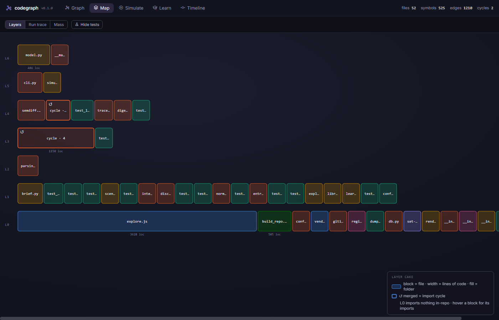
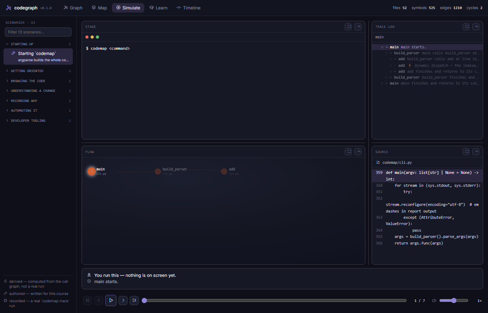
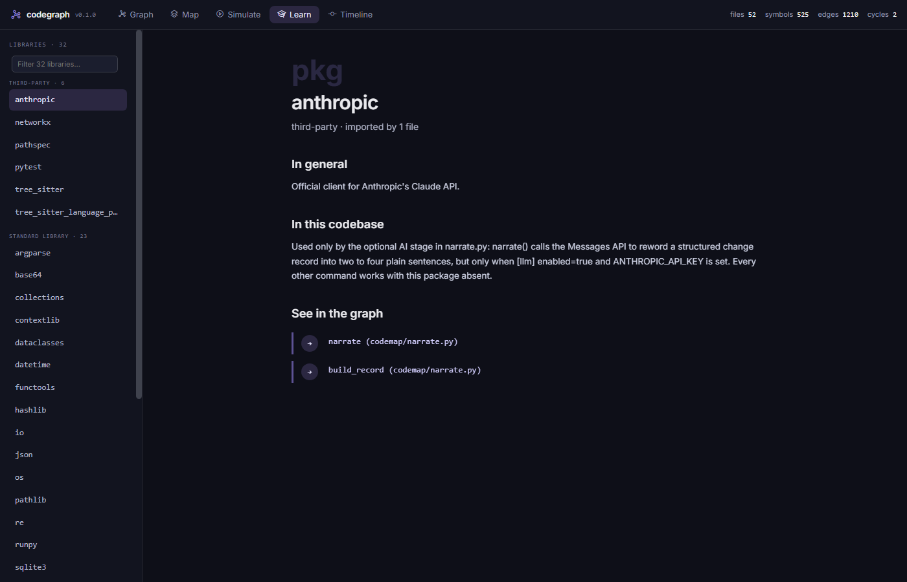
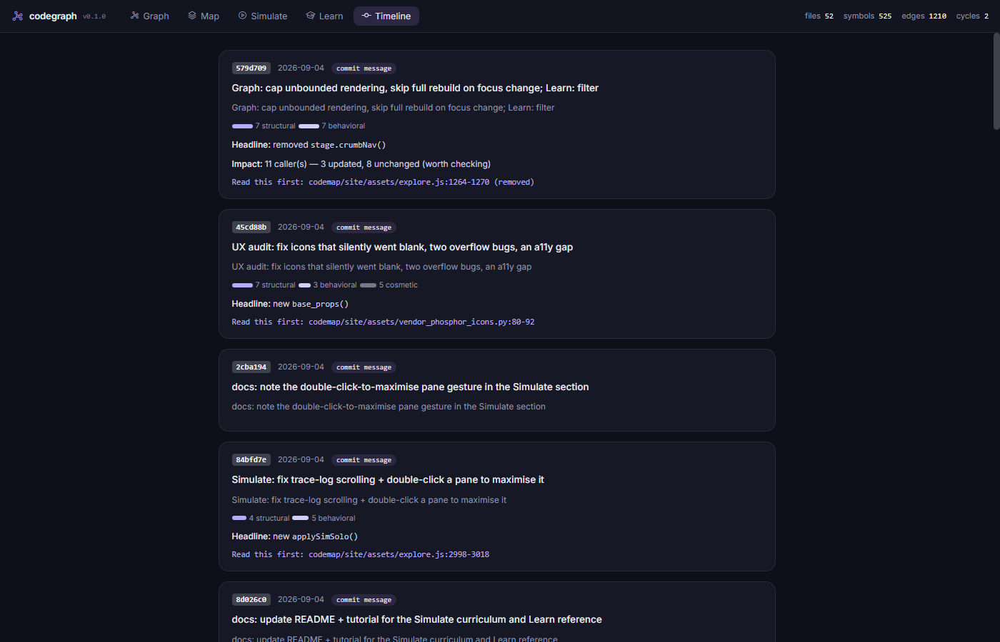

# codemap — change explainer for AI-assisted codebases

[](https://github.com/OWNER/codemap/actions/workflows/ci.yml)
[](LICENSE)

`codemap` keeps a symbol-level graph rooted in **the worktree** — the code as
it is on disk right now, uncommitted changes included — and renders it as one
self-contained, double-click-to-open HTML page. After every commit, it also
answers the question this tool was built around:

> What changed, why, what does it affect, and which forty lines should I read myself?


## Two pieces

|  | **The tool** | **The skills** |
|---|---|---|
| What | the `codemap` CLI | a Claude Code plugin |
| Install | `pipx install git+https://github.com/OWNER/codemap` | `/plugin install codemap@codemap` |
| Needs | Python 3.11+ | the tool, installed first |
| Does | indexes your repo, explains diffs, renders `explore.html` | authors the prose `explore.html` can't derive on its own |
| Optional? | — | yes — every tab has a deterministic fallback with zero authored content |

```
codemap scan  →  .codemap/index.db  →  codemap explore  →  explore.html
                                              ▲
              .codemap/{libraries,explanations,scenarios}.json
              (optional — authored by the codebase-to-course skill)
```

See [`docs/skills.md`](docs/skills.md) for exactly how the two halves fit
together, and why the split is deliberate.

## Quickstart

```
pipx install git+https://github.com/OWNER/codemap
cd your-repo
codemap scan
codemap explore --open
```

That's the whole tool. Full flag reference: [`docs/cli.md`](docs/cli.md).
Full walkthrough of the rendered page: [`docs/explore-guide.md`](docs/explore-guide.md).
More install options (uv, from source, Windows notes, the plugin):
[`docs/install.md`](docs/install.md).

## The five tabs

| Tab | Answers | |
|---|---|---|
| **Graph** | What calls what — source tree, a neural-style code graph, focus any symbol to see its callers/callees, blast radius, and source. |  |
| **Map** | What shape is the system, and where — dependency layers, a subway-map run trace, a treemap of the whole repo. |  |
| **Simulate** | What happens when it *runs* — a transport-controlled animation of one call-by-call scenario, with a scrollable trace log. |  |
| **Learn** | What every dependency and repo module actually does, in general and in this codebase. |  |
| **Timeline** | Every commit, its stated intent, and its blast radius. |  |

Icons are vendored into the page itself (base64, no CDN) — they render the
same offline or on a network that blocks arbitrary CDNs. The body font
degrades gracefully if Google Fonts is unreachable. The generated page never
calls an LLM.

## Known blind spots

- Dynamic imports, `getattr`/dictionary dispatch, string-based routing,
  dependency injection, and wrapping decorators are invisible or distorted in
  the graph — the Map tab's Run trace marks where a chain hits one of these
  instead of silently stopping.
- Caller resolution is name-based, narrowed by same-file and then by import
  evidence (`EXTRACTED`/`INFERRED`/`AMBIGUOUS`, shown per edge) — false
  positives and false negatives both remain possible, especially outside
  Python/TypeScript/JavaScript.
- Go and Rust methods show up with a flat name, not `Type.method` — see
  [`docs/spec.md`](docs/spec.md) §14.
- Impact analysis is structural only; it can't tell you whether a change is
  *correct*.
- Intent marked `inferred` is a guess, not a record.

Full detail, including the tiered-accuracy model and per-language coverage,
in [`docs/spec.md`](docs/spec.md).

## Contributing

```
python -m venv .venv
.venv/Scripts/python -m pip install -e ".[dev]"
python -m pytest
```

See [`CONTRIBUTING.md`](CONTRIBUTING.md) for the full setup, the one
generated asset you should never hand-edit, and PR expectations.

## License

MIT — see [`LICENSE`](LICENSE).
